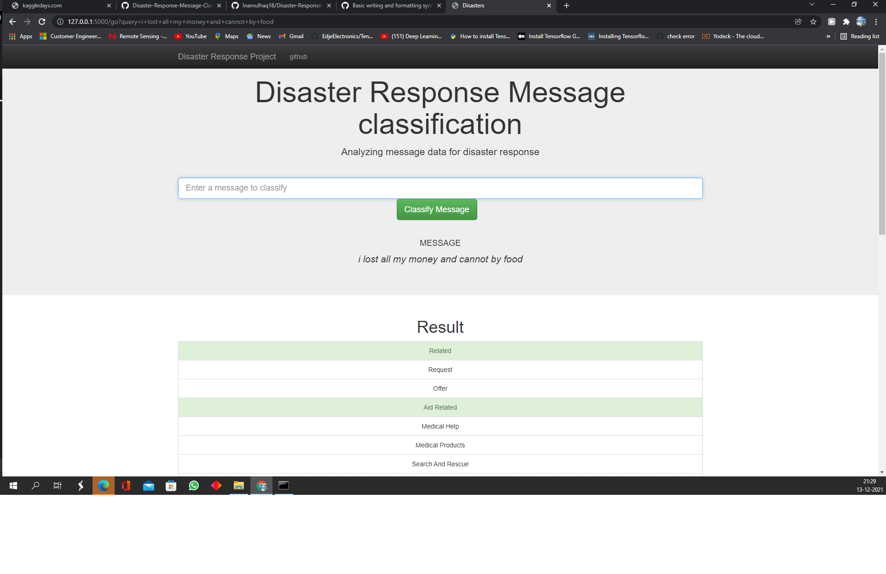

# Disaster Response Pipeline

github link : https://github.com/Inamulhaq18/Disaster-Response-Message-Classifier

This project involves working with a figure8 disaster response dataset, to build and deploy a machine learning classifier, to classify messages to reach their respective disaster response departments.

## Installations

Following libraries were used (preinstalled):

pandas
numpy
nltk
sklearn- 0.19.1
sqlalchemy
pickle
re
##Project components:
The project consists of three components

### 1. ETL Pipeline

Explore the database provided by figure8
Clean the database and distribute the columns for eact category
Make a SQL DB file

### 2. ML Pipeline

Use the DB created in the last step 
Build a ML pipeline using multioutput classifer
Use grid search to find the best parameters 
Save the model as a pickel file

### 3. Flask web app

Use the Flask library to host the project
Use the Templates provided by Udacity for the front-end of the system
use the pickel file to load the model and classify the messages 

# Instructions to run the ETL pipeline, ML Pipeline and the Web app:

Run the following commands in the project's root directory to set up your database and model.

## To run ETL pipeline that cleans data and stores in database 

python data/ETL_pipeline.py data/messages.csv data/categories.csv data/sqldatabase.db

## To run ML pipeline that trains classifier and saves(the second parameter passsed below is the location to save the pickel file)

python models/ML_Pipeline.py data/sqldatabase.db models/classifier.pkl

## To run the webapp, 
Step 1 - Go to the app directory 

Step 2 - once inside app directory run 

python app.py

this should start the server and you should be able to see the app by going to http://0.0.0.0:3001/ Or Go to http://localhost:3001/

You need to have all the libararies installed beforing running the app.

File structure:
Here's the file structure of the project:

### App

| - template

| |- master.html # main page of web app

| |- go.html # classification result page of web app

|- app.py # Flask file that runs app

### Data

|- disaster_categories.csv # data to process

|- disaster_messages.csv # data to process

|- process_data.py

|- DisasterResponse.db # database to save clean data to

### Model

|- train_classifier.py

|- classifier.pkl # saved mode

Acknowledgements
Data has been provided by Figure Eight

Tutorials from Pandas and Sklearn were used developing the code:

http://pandas.pydata.org/
http://pandas.pydata.org/Pandas_Cheat_Sheet.pdf
http://scikit-learn.org/stable/modules/model_evaluation.html#classification-report
http://scikit-learn.org/stable/modules/classes.html#module-sklearn.ensemble
Along with lessons in the Udacity Data Science Nanodegree

Software engineering (Pandas and Flask)
Data engineering (ETL, NLP, ML Pipelines)

Project By Inamul Haq
